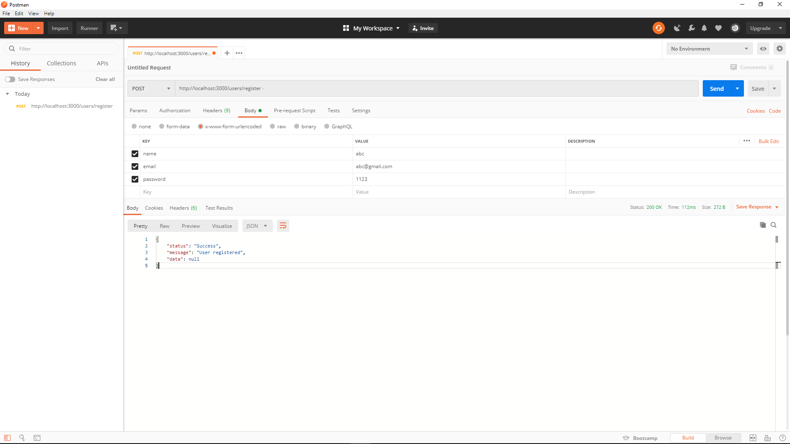
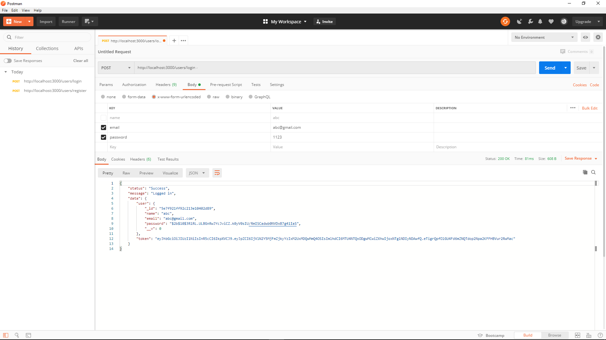
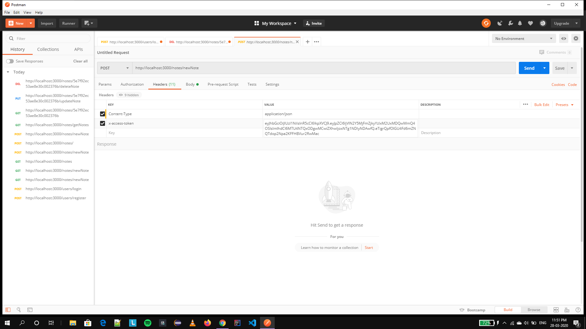
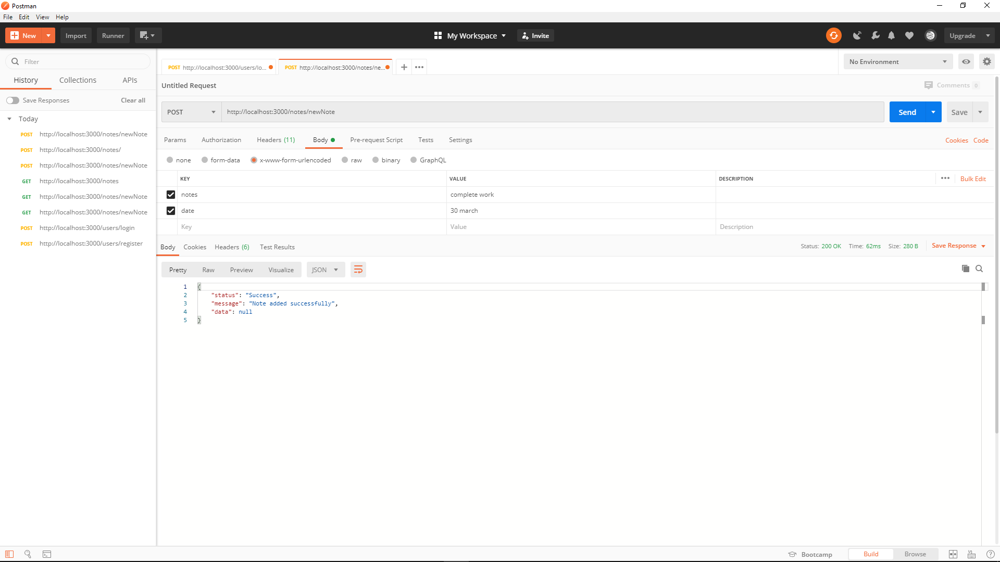
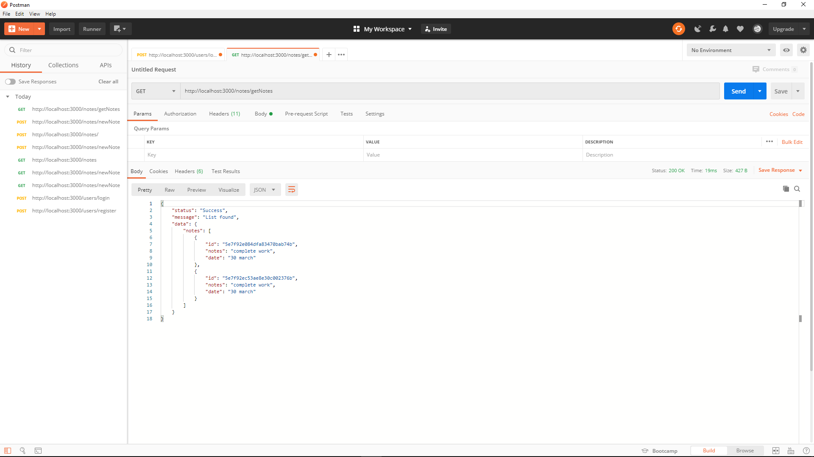
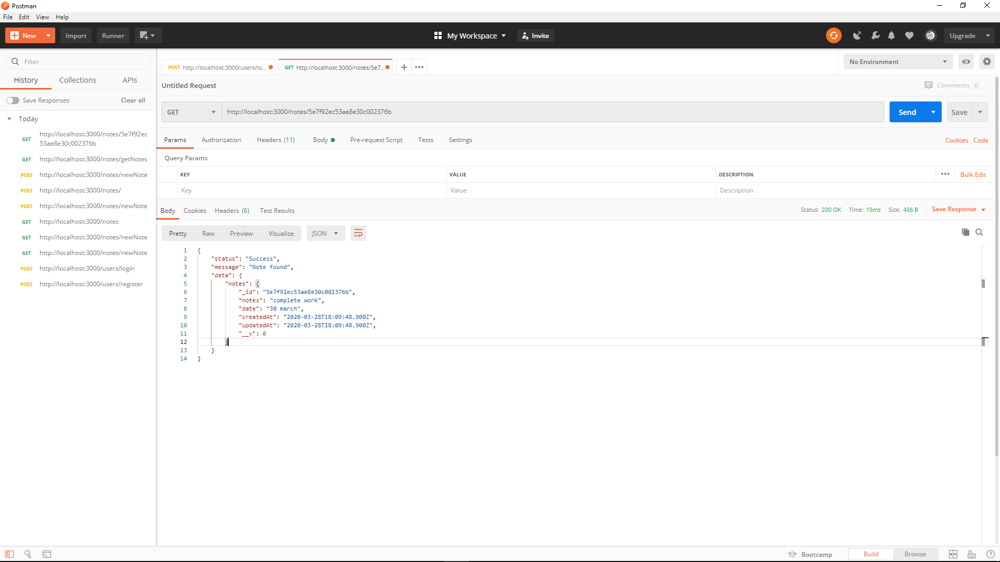
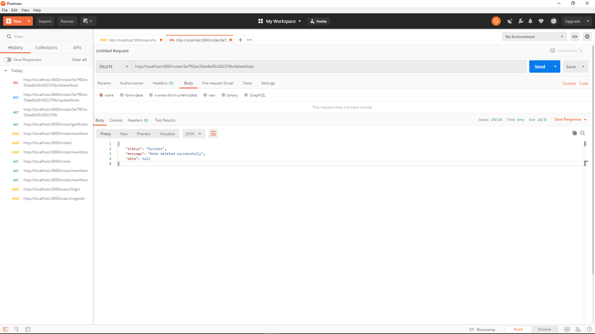
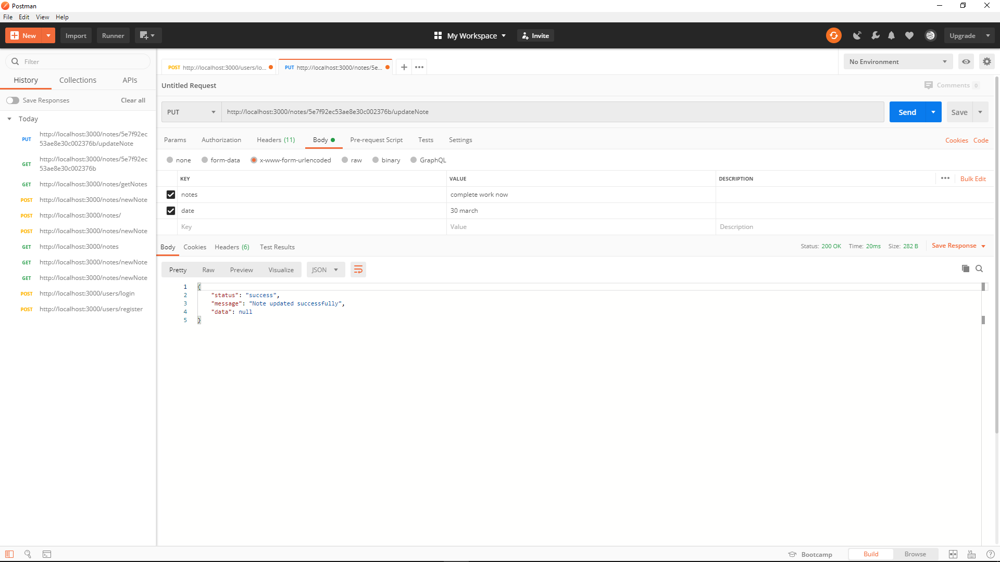

# Notes-App
Notes app using RestApi, The user registeration and login api with jwt authentication . Crud operations on notes and get list of all notes.

1.Open terminal and run index.js. Then on browser run on localhost:8000.

2. Register user on POST- http://localhost:8000/users/register and fill name ,email and password in body/x-www-form-urlencoded.

3. Login with email and password.  POST-http://localhost:8000/users/login and fill email and password in body/x-www-form-urlencoded. A jwt token will be generated, copy it.

*NOTE - FOR EVERY OPERATION YOU NEED THE TOKEN FOR VALIDATION*

4. To create a note POST- http://localhost:8000/notes/newNote.
Go into header. Fill one column with content-type = application/json and other with x-access-token = copied token value.
In body/x-www-form-urlencoded fill notes and date.

5. To get list of all notes. GET- http://localhost:8000/notes/getNotes

6. To get note by ID paste id of note at "id". GET- http://localhost:8000/notes/"id"

7. To delete a note by ID paste id of note at "id". DELETE- http://localhost:8000/notes/"id"/deleteNote

8.To update a note by ID paste id of note at "id" and make the changes in body/x-www-form-urlencoded. PUT- http://localhost:8000/notes/"id"/updateNote

